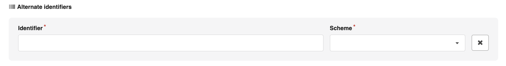

# Romanian Summarization Dataset

## CSV File Format
The CSV files must have the following header (7 columns):
`Document,Summary,Title,Keywords,Url,Author,Topic`

Example of a valid CSV file:
```csv
Document,Summary,Title,Keywords,Url,Author,Topic
Doc1Text,Sum1Text,Title1,Keywords1Text,Url1,Author1,Topic1
Doc2Text,Sum2Text,Title2,Keywords2Text,Url2,Author2,Topic2
...
```

The CSV files must have the following format:
- The first row must be the header
- The header must be exactly as above
- Each row must have the same number of columns (6)
- Comma-separated values
- UTF-8 encoding

> **Warning**
**When adapting you files to this required format, please keep all the rows, even if some values are missing. For example, if you don't have the author of a document, please keep the column and leave it empty. In this way, we do not lose any information and maybe for a certain downstream task, we do not need the author, but we need the document and the summary.**

## Checker Usage
```sh
$ python3 checker.py --input-dir=<input_directory>
```

## Checker Output
The checker will warn you if the CSV files are not valid.

If the CSV files are valid, the checker will try to parse the CSV files and will output the status for each file.

## How to add a dataset
- Create a Zenodo account: https://zenodo.org/
- Request access to the `Romanian Summarization` community: https://zenodo.org/communities/romanian_summarization
    - If this doesn't work, please contact me and I will add you to the community.
- Go to the `Romanian Summarization` community and click on `New Upload`
- Upload all your CSV files
- **Set `Visibility` to `Restricted` (only members of the community can access the dataset)**
- Select `No` for `Do you already have a DOI for this upload?`
- `Resource Type` should be `Dataset`
- `Title` should contain the dataset sources separated by underscores (e.g: protv_digi24)
- You can simply close sections like the following by clicking on the `X` button on the right

- Click on `Submit for review` and wait for the dataset to be approved.

- After this process, the dataset will be checked by the owner using the checker and if everything is ok, the dataset will be published.
- Please make sure that the CSV files are valid before uploading them to Zenodo.
